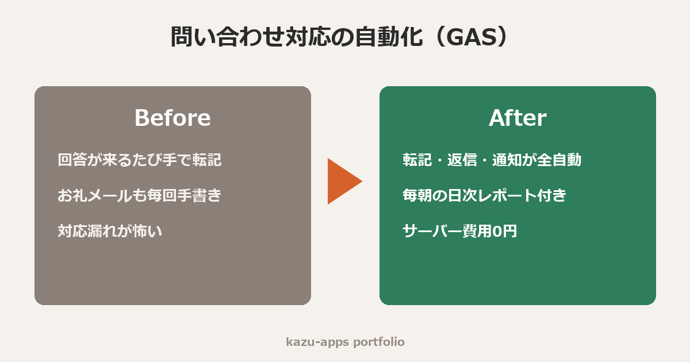

# お問い合わせフォーム自動化セット（GASデモ）

Googleフォーム＋スプレッドシート＋Gmailを連携させ、**問い合わせ対応の初動を完全自動化**するGoogle Apps Scriptのデモです。

## できること

| # | 機能 | 効果 |
|---|------|------|
| 1 | フォーム回答をシートに自動転記（ステータス列付き） | 対応漏れをなくす管理台帳が自動で育つ |
| 2 | 回答者へ自動お礼メール | 「返事が来ない」離脱を防止 |
| 3 | 管理者へ新着通知メール | スマホですぐ気づける |
| 4 | 毎朝9時の日次レポート | 前日の件数と未対応数をひと目で把握 |

すべてGoogleアカウントだけで動きます。**サーバー費用・月額費用は0円**です。

## 導入手順（約10分）

1. Googleフォームを作成し、回答先のスプレッドシートを用意する
2. スプレッドシートの「拡張機能 → Apps Script」を開き、`code.gs` の内容を貼り付ける
3. 冒頭の `CONFIG`（管理者メール・店舗名・質問タイトル）を書き換える
4. トリガーを2つ設定する
   - `onFormSubmitHandler` … イベントの種類「フォーム送信時」
   - `sendDailyReport` … 時間主導型「日付ベース・午前8〜9時」
5. 初回実行時に権限を承認して完了

## カスタマイズ例（対応可能なご依頼）

- 自動返信文のHTMLメール化・予約確認メール化
- Slack / LINE / Chatwork への通知
- 回答内容による振り分け（例：「見積もり希望」だけ営業担当へ）
- 週次・月次の集計グラフ自動生成
- 既存の業務スプレッドシートへの組み込み

## 補足

- このコードはポートフォリオ用デモです。実案件では業務フローをヒアリングのうえ、環境に合わせて調整して納品します。
