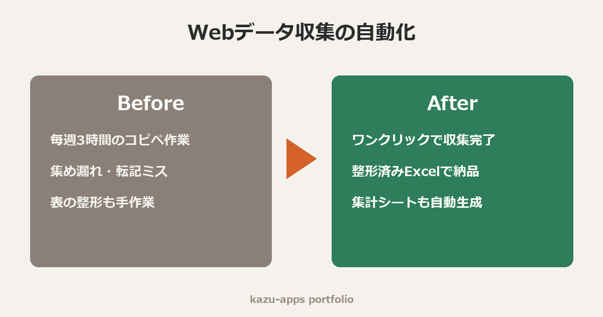

# Webスクレイピング＆Excelレポート自動生成デモ



Webサイトから情報を自動収集し、**そのまま提出できる整形済みExcelレポート**に変換するデモです。

## 成果物サンプル

`books_report.xlsx` … 実際にこのスクリプトが生成したファイルです。

- **データ一覧シート**: 見出しの色付け・罫線・列幅調整・オートフィルタ・ウィンドウ枠固定 設定済み
- **サマリーシート**: 件数・平均/最高/最低価格・評価別の集計

## デモの内容

スクレイピング練習用の公開サイト [books.toscrape.com](https://books.toscrape.com/) から
書籍60件（タイトル・価格・評価・在庫・URL）を収集しています。

同じ仕組みで、以下のようなご依頼に対応できます。

- ECサイトの商品情報・価格の定期収集（価格調査・競合モニタリング）
- 一覧ページ＋詳細ページをたどる多段階の収集
- 収集結果のCSV / Excel / Googleスプレッドシート出力
- 毎日・毎週の自動実行（タスクスケジューラ / GitHub Actions）

## 対応方針（安心して発注いただくために）

- 対象サイトの利用規約・robots.txt を事前に確認し、**規約違反となる収集はお断りしています**
- リクエスト間隔を空け、対象サーバーに負荷をかけない設計にしています
- ログイン必須サイト・会員限定情報の収集は、権利関係を確認のうえ対応可否を判断します

## 実行方法

```bash
pip install requests beautifulsoup4 openpyxl
python scrape_books.py
```
